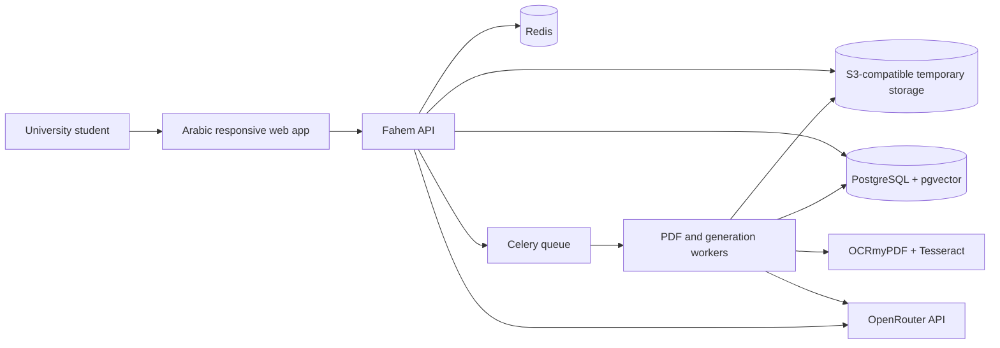
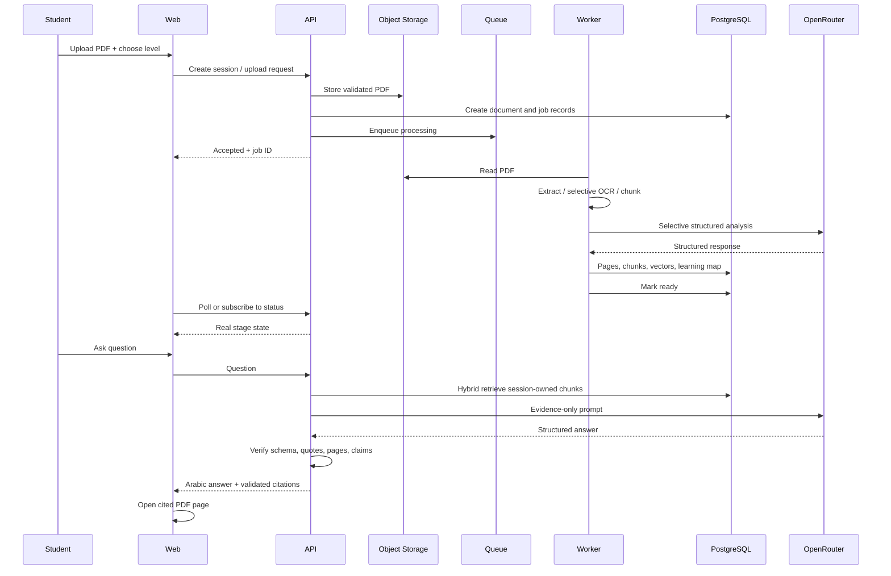

# Solution Architecture

## 1. Context

## 2. Components

### `apps/web`

- Next.js App Router and TypeScript.
- Arabic RTL pages and accessible component system.
- Upload, level selection, processing state, learning path, explanation workspace, chat, summaries, quizzes, flashcards, and session deletion.
- PDF.js viewer with page navigation and optional highlight overlays.
- No direct access to OpenRouter, database, Redis, or object storage credentials.

### `apps/api`

- FastAPI versioned API.
- Anonymous session creation and cookie handling.
- Upload orchestration and signed/proxied object operations.
- Ownership checks, rate limits, status endpoints, chat orchestration, and deletion.
- OpenAPI source of truth.

### `apps/worker`

- Celery workers for PDF validation, extraction, OCR, visual analysis, structure generation, embeddings, summaries, quizzes, flashcards, and cleanup.
- Separate queues and resource limits for CPU-heavy OCR and network AI tasks.

### Data services

- PostgreSQL: source metadata, pages, chunks, vector embeddings, learning map, messages, generated artifacts, jobs, citations, expiry state.
- Redis: session state/cache, queue broker/result state, locks, idempotency, rate limiting, and TTL signals.
- S3-compatible storage: original PDF and temporary page images/crops. Production bucket lifecycle must exceed application TTL only by a small recovery margin.

### AI adapter

- Server-side OpenRouter adapter.
- Task profiles: analysis, chat, vision, generation.
- Primary and fallback model per profile.
- Structured-output support detection and validation.
- ZDR and data-collection restrictions.
- Token/cost budgets, timeout, bounded retries, circuit breaker, and content-free telemetry.

## 3. Key data flow

## 4. Deployment topology

- Web and API are stateless containers behind TLS termination.
- Workers scale independently by queue.
- Database, Redis, and object storage are managed services in production where possible.
- Egress can be restricted to OpenRouter and required package/monitoring endpoints.
- PDF processing containers use read-only root filesystem, non-root user, temporary workspace quotas, and no unnecessary network access.

## 5. Availability and failure behavior

- Provider timeout: retry within budget, then configured fallback with identical privacy rules.
- Structured output invalid: one repair attempt, then safe failure.
- OCR failure on some pages: mark degraded/partial and expose affected pages; do not pretend full success.
- Cleanup failure: retry idempotently and alert on deletion lag without logging content.
- Database/storage mismatch: reconciliation job finds orphaned artifacts by session/document IDs.

## 6. Architecture constraints

- No model-specific code outside adapters.
- No storage credentials in web code.
- No citations directly accepted from model output.
- No business logic in UI components or endpoint functions.
- No permanent data without a future explicit product decision and redesigned consent model.
